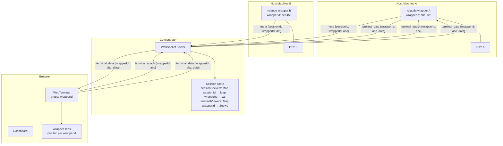
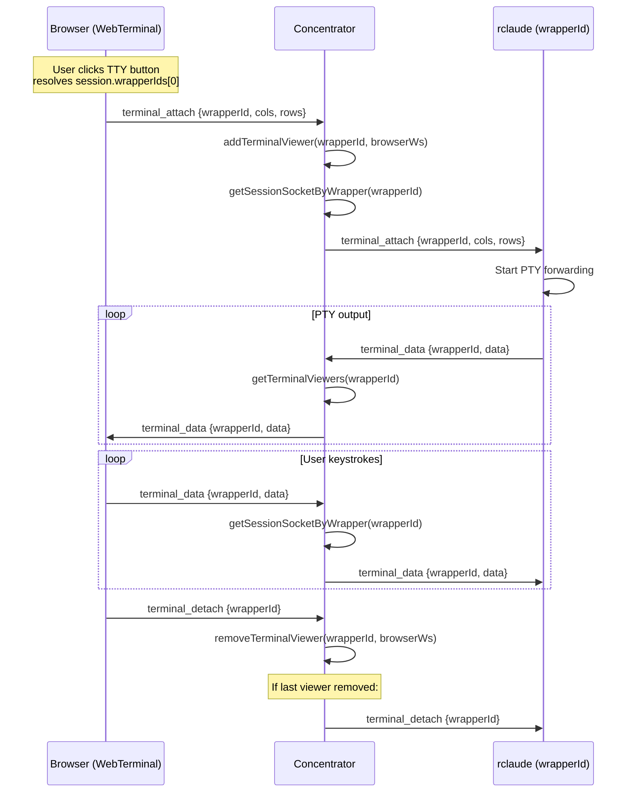
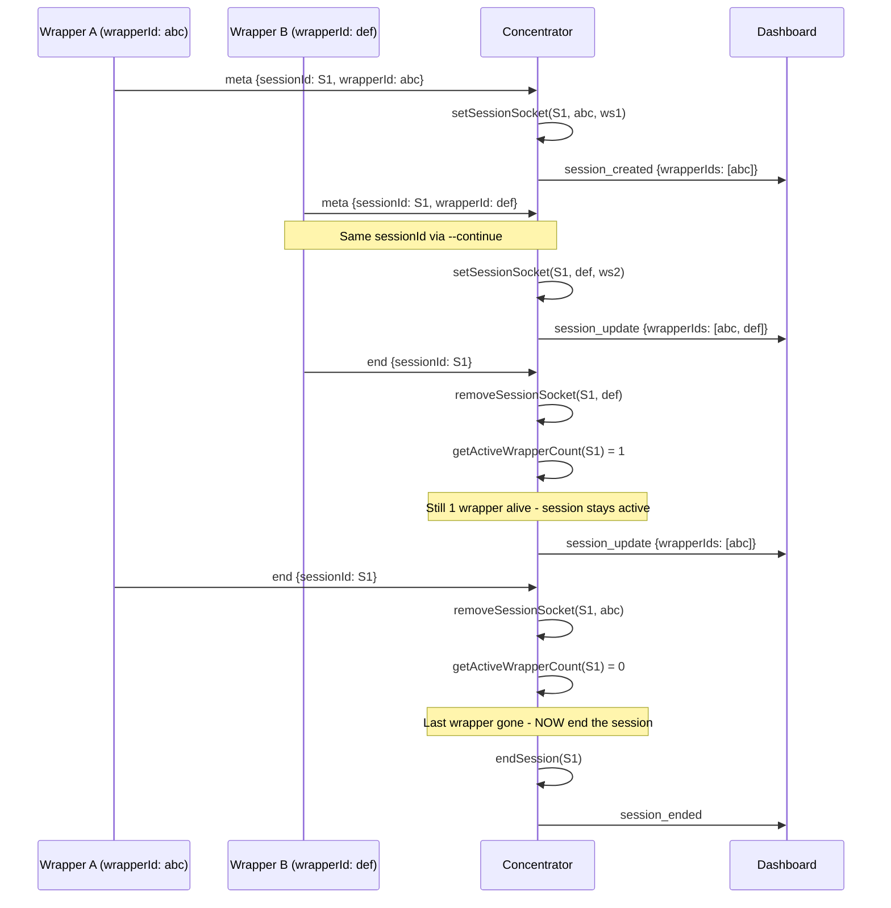
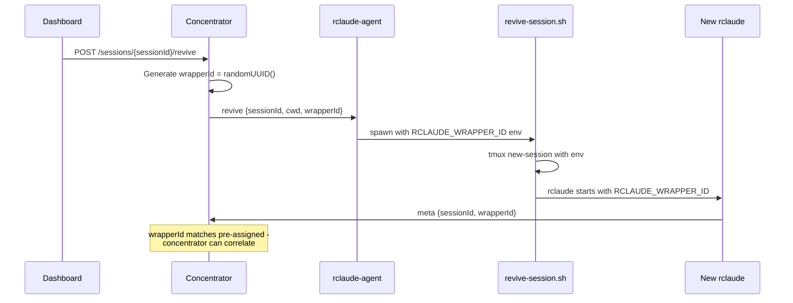

# Terminal Routing Flow

## Identity Model

```
wrapperId = physical identity (this machine, this process, this PTY)
sessionId = logical identity (Claude Code session, can be shared via --continue)
```

Multiple wrappers can share a sessionId. Each wrapper has exactly one PTY.
A session only ends when its LAST wrapper disconnects.

## Data Flow



## Terminal Message Routing

All terminal messages route by `wrapperId`, never `sessionId`:



## Store & UI Routing

```mermaid
graph LR
    subgraph "Zustand Store"
        TWI[terminalWrapperId: string | null]
        ST[showTerminal: boolean]
        OT["openTerminal(wrapperId)"]
    end

    subgraph "session-detail.tsx"
        TTY[TTY Button click]
        TTY -->|"session.wrapperIds[0]"| OT
    end

    subgraph "app.tsx"
        KBD["Ctrl+Shift+T"]
        SW[Switcher select]
        KBD -->|"session.wrapperIds[0]"| OT
        SW -->|"session.wrapperIds[0]"| OT
    end

    subgraph "web-terminal.tsx"
        WT["WebTerminal(wrapperId)"]
        WTABS["Wrapper Tabs"]
        WT --> WTABS
        WTABS -->|"click tab"| OT
    end

    OT --> TWI
    OT --> ST
    TWI --> WT
```

## Session Lifecycle with Multiple Wrappers



## Revive Flow with Pre-assigned wrapperId



## URL Hash Routing

| Hash | Meaning |
|------|---------|
| `#session/{sessionId}` | Select session in main panel |
| `#terminal/{wrapperId}` | Open terminal overlay for wrapper |
| `#popout-terminal/{wrapperId}` | Popout terminal window for wrapper |
