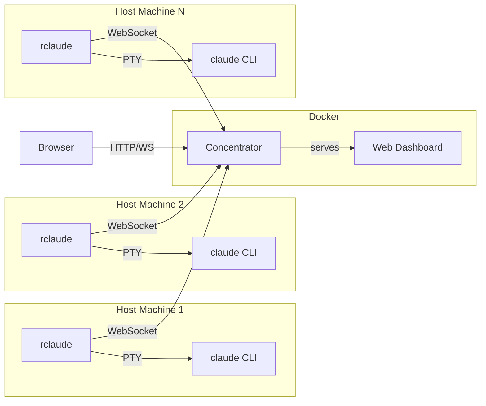

```
                               __               __                __
   ________  ____ ___  ____  / /____     _____/ /___ ___  ______/ /__
  / ___/ _ \/ __ `__ \/ __ \/ __/ _ \   / ___/ / __ `/ / / / __  / _ \
 / /  /  __/ / / / / / /_/ / /_/  __/  / /__/ / /_/ / /_/ / /_/ /  __/
/_/   \___/_/ /_/ /_/\____/\__/\___/   \___/_/\__,_/\__,_/\__,_/\___/

        ┌─────────────────────────────────────────────────────┐
        │  SESSION MONITORING + REMOTE CONTROL FOR CLAUDE CODE │
        └─────────────────────────────────────────────────────┘
```

> **We're looking for a new name.** The current working title is `remote-claude` but it deserves
> something with more personality. See [NAMES.md](NAMES.md) for the candidate list -- favorites
> include **CLAUDVOYANT**, **THUNDERCLAUDE**, **CLAUDWERK**, and **PANOPTOCLAUDE**.
> Suggestions welcome.

---

## What is this?

**remote-claude** turns Claude Code from a local-only CLI tool into a remotely accessible,
multi-machine AI workstation you can monitor and control from anywhere.

Run `rclaude` instead of `claude`. It wraps the CLI with a PTY, injects hooks, and streams
everything -- events, transcripts, terminal I/O, tasks, sub-agents -- over a single WebSocket
to a central server. Open the dashboard on your phone, your iPad, a borrowed laptop, whatever.
Your Claude sessions are right there, live, with full interactive terminal access.

**The killer feature: tunnel a real TTY to your running Claude session over the web.** Not a
log viewer. Not a read-only transcript. A full interactive terminal -- xterm.js backed by the
actual PTY process on your host machine. Type commands, approve tool calls, paste code, resize
the window. It's your terminal, streamed through a WebSocket tunnel to any browser on any device.

Sitting on the couch with your iPad? Open the dashboard, tap your session, hit the TTY button.
You're in. Full terminal. Same session your desktop started. On a friend's laptop and need to
check on a long-running Claude task? Log in with your passkey, open the terminal, and you're
there. No SSH keys to configure, no VPN to connect, no port forwarding to set up.

## Why does this exist?

Claude Code is incredible but it's trapped in your terminal. You start a big task, walk away,
and have no idea what happened until you come back to the same machine, the same terminal, the
same tmux session. If you're running Claude on multiple projects across multiple machines,
there's no way to see all of them in one place.

This fixes that. All of it.

## What makes it awesome

### Live Terminal Over the Web

Full xterm.js terminal tunneled through WebSocket to your host's PTY. Not a simulation -- the
real terminal, with all its state, colors, cursor position, and scroll buffer. Works on phones,
tablets, laptops, anything with a browser. Popout to a separate window with Shift+click. Multiple
terminal themes (Dracula, Tokyo Night, Monokai, etc.), adjustable fonts, touch-friendly toolbar
with Ctrl+C, paste, and copy buttons.

### Rich Remote Input

Send prompts to Claude from any device with a full markdown-aware input bar. Syntax-highlighted
as you type, Shift+Enter for multiline. Paste images from clipboard, drag-and-drop files, or
use the attach button to upload -- images are embedded inline and sent to Claude as context.
Voice recording support for hands-free input on mobile.

### Real-Time Session Dashboard

Watch Claude work in real-time from anywhere. Full transcript with syntax-highlighted code blocks
(Shiki), inline images, markdown rendering, and diff visualization. See every tool call as it
happens -- Bash commands, file reads, edits, grep results -- with expandable input/output details.
Skill/command content is auto-collapsed into compact teal pills (click to expand) instead of
flooding the transcript with walls of injected markdown. Auto-follow mode scrolls with new
content; scroll up to pause, scroll back down to resume.

### Multi-Machine Aggregation

Run Claude on your desktop, your server, your CI runner -- all sessions stream to one concentrator.
The dashboard shows them all, grouped by project, with custom labels, icons, and colors. Switch
between sessions instantly with Ctrl+K (QuickSilver-style fuzzy finder). Never lose track of
what's running where.

### Sub-Agent & Team Tracking

Claude spawns background agents? You see them. Live status badges show running/completed state,
event counts, and elapsed time directly in the transcript. Click into any agent to see its full
transcript. Team sessions (multi-agent coordination) show teammate status, current tasks, and
completion progress.

### Task & Background Process Monitoring

All tasks (pending, in-progress, completed) visible in a dedicated tab with blocking relationships
and owner assignments. Background Bash processes tracked with their commands, descriptions, and
run times. Archived tasks grouped by date for history.

### File Editor & Browser

Browse and edit markdown files in your session's working directory directly from the dashboard.
CodeMirror-powered editor with syntax highlighting, version history, conflict detection (file
changed on disk while you were editing), and one-click restore. Hit Ctrl+K and type `F:` to
open the QuickSilver-style file browser -- fuzzy-search your project's files and jump straight
into editing. Quick notes (Ctrl+Shift+N) append to a NOTES.md in the project root.

### Passkey-Only Authentication

No passwords. No API tokens. No self-registration. WebAuthn passkeys only.

New users can ONLY be created through CLI-generated invite codes -- there is no web-based
registration. You run `concentrator-cli create-invite --name someone` on the server, it prints
a one-time link, they register their passkey, done. This means an attacker with access to the
web interface alone cannot create accounts. The invite flow requires server-side CLI access.

Session cookies are HMAC-SHA256 signed. The signing secret is auto-generated and stored with
0600 permissions. Revoked users are blocked immediately.

### Push Notifications

PWA push notifications when Claude needs your attention. Works on mobile browsers -- get
notified when sessions are waiting for input even when the tab is closed or your phone is
locked.

**Setup:** Generate VAPID keys and add them to your `.env`:

```bash
# Generate keys
npx web-push generate-vapid-keys

# Add to .env
VAPID_PUBLIC_KEY=BPxr...your-public-key
VAPID_PRIVATE_KEY=abc...your-private-key
```

Restart the concentrator, then open Settings in the dashboard and click **Enable** under
Notifications. Your browser will ask for notification permission -- accept it, and you're
done. Each browser/device subscribes independently.

VAPID keys are NOT derived from `RCLAUDE_SECRET` -- they're a separate keypair used
exclusively for the Web Push protocol. Generate them once, keep them forever.

**Automatic triggers:** The concentrator sends push notifications automatically when:
- A session fires a `Notification` hook (Claude needs input)
- A session fires a `Stop` hook (Claude stopped working)

**Send notifications from scripts/hooks:** Use the REST API to push from anywhere --
CI pipelines, cron jobs, Claude Code hooks, or your own tooling:

```bash
curl -X POST https://concentrator.example.com/api/push/send \
  -H "Authorization: Bearer $RCLAUDE_SECRET" \
  -H "Content-Type: application/json" \
  -d '{"title": "Build complete", "body": "Deploy finished in 42s"}'
```

**CLAUDE.md tip:** Add this to your project's `CLAUDE.md` so Claude can notify you
when it finishes long-running tasks, deploys, or hits errors:

```markdown
## Push Notifications

Send me a push notification through the concentrator when you complete
significant work, encounter errors, or finish long-running tasks.

### curl
\`\`\`bash
curl -s -X POST $RCLAUDE_CONCENTRATOR/api/push/send \
  -H "Authorization: Bearer $RCLAUDE_SECRET" \
  -H "Content-Type: application/json" \
  -d '{"title": "Deploy complete", "body": "Production build deployed in 42s"}'
\`\`\`

### Examples of when to notify:
- Build/deploy finished (or failed)
- Long test suite completed
- Task list fully cleared
- Error that needs my attention
- Waiting for my input on something important
```

Replace `$RCLAUDE_CONCENTRATOR` with your actual concentrator URL
(e.g. `https://concentrator.example.com`). The `$RCLAUDE_SECRET` env var
is already available in Claude's shell when running under `rclaude`.

**API reference:**

| Field | Type | Description |
|-------|------|-------------|
| `title` | string | Notification title (required if no body) |
| `body` | string | Notification body (required if no title) |
| `sessionId` | string | Optional - links notification to a session |
| `tag` | string | Optional - dedup key (same tag replaces previous) |

Auth: `Bearer` token must match your `RCLAUDE_SECRET`.

### MCP Channel & Tools

When running with channels (default), Claude gets MCP tools for interacting with the dashboard:

| Tool | Description |
|------|-------------|
| `notify` | Send push notification to user's devices |
| `share_file` | Upload a file and get a public URL |
| `list_sessions` | Discover sessions (returns stable address book IDs) |
| `send_message` | Message a session by ID (delivers or queues if offline) |
| `configure_session` | Update project label/icon/color/keyterms (benevolent) |
| `spawn_session` | Launch a new session in a project (benevolent) |
| `quit_session` | Stop another session (benevolent) |
| `revive_session` | Restart an ended session (benevolent) |
| `toggle_plan_mode` | Switch plan mode on/off |
| `check_update` | Check if a newer rclaude version is available on GitHub |

### Session Organization

Drag-and-drop session grouping in the sidebar. Create named groups, drag sessions between
them, collapse/expand groups. Groups persist across restarts. Unorganized sessions appear
below the tree. Ended sessions can be dismissed individually or batch-cleared per group.

### Session Revival

Session went idle? Revive it from the dashboard or via MCP tool. The host agent
(`rclaude-agent`) listens for revive commands and spawns a new tmux session with
`rclaude --resume`, reconnecting your Claude session without touching the host machine.

### Inter-Session Communication

Sessions can discover and message each other. `list_sessions` returns stable, human-readable
IDs (e.g. `"agent-drop"`, `"wandershelf"`) that persist forever -- auto-assigned per caller
from project names. Use these IDs with `send_message` to talk to other sessions.

**Offline delivery:** Messages to disconnected sessions are queued and delivered automatically
when the target reconnects. `send_message` returns `status: "delivered"` or `status: "queued"`
so Claude knows whether the message arrived immediately or is waiting.

**Trust levels** control who can talk to whom:
- **Default** -- first contact requires dashboard approval (ALLOW/BLOCK banner)
- **Open** -- any session can message this project without approval
- **Benevolent** -- this project can message any session AND control their lifecycle (revive/quit/configure)

Links persist across restarts (stored as CWD pairs, not session IDs). Message history logged
with 200-char previews. Click a linked session name to see the conversation timeline.

**Address book isolation:** Each session sees other sessions through locally-scoped IDs.
Session A's `"agent-drop"` and session B's `"agent-drop"` might point to different projects.
Leaked IDs are useless to other sessions -- the concentrator validates every address lookup
against the caller's own address book.

Benevolent sessions get extra MCP tools: `revive_session` and `quit_session` for managing
other sessions' lifecycles remotely.

### Voice Input

**Touch devices (FAB):** Floating hold-to-record button on the right edge. Two-stage activation:
first tap requests mic permission, second tap starts recording. Drag left to cancel. Release to
submit. Interim transcription via Deepgram, optional Haiku refinement pass.

**Desktop (push-to-talk):** Configure any key as a push-to-talk binding in Settings > Input.
Hold the key to record, release to submit. Works with F-keys, modifier keys, ScrollLock, etc.
Recording indicator banner with live transcript at the top of the screen.

### Clipboard Capture

When Claude copies text to clipboard, the dashboard captures it as a cyan CLIPBOARD banner
with COPY/DISMISS buttons. Works via OSC 52 interception -- Claude's clipboard writes go
through the PTY stream, rclaude extracts them, and forwards to the dashboard. Supports both
text and images. History persisted in the Shared tab.

### Chat Bubbles & Customization

User messages render as iMessage-style right-aligned bubbles. Pick from 7 color presets
(blue, teal, purple, green, orange, pink, indigo) in Settings > Display. Inter-session
messages render as teal cards with sender name, intent badge, and clickable project name.

### Project Customization

Label your projects, pick icons (50+ Lucide icons), set colors, configure trust levels.
The sidebar and session switcher show your custom branding. Settings persist on the server,
shared across all dashboard clients.

---

## Architecture



**Data flow:** rclaude wraps the `claude` CLI with a PTY, injects hooks, and streams everything
(events, transcripts, tasks, terminal output) to the concentrator over a single WebSocket. The
concentrator stores sessions in memory, persists to disk, and serves the dashboard. No filesystem
sharing between host and Docker.

**Components:**

| Component | What it does |
|-----------|-------------|
| **rclaude** | CLI wrapper. Spawns claude with PTY, injects hooks, MCP channel server, streams to concentrator |
| **concentrator** | Central server. Hono HTTP + WS + WebAuthn + inter-session routing + voice relay. Runs in Docker |
| **dashboard** | React SPA. Vite + Tailwind + Zustand. Voice, terminal, transcript, DnD, chat. Served by concentrator |
| **rclaude-agent** | Host-side agent. Listens for revive/spawn commands, manages tmux sessions |
| **concentrator-cli** | CLI for auth management. Create invites, list/revoke users |

---

## Quick Start

### Prerequisites

- [Claude Code](https://claude.ai/code) CLI installed
- Docker (for concentrator)
- [Bun](https://bun.sh) runtime (v1.2+) — the installer will auto-install it if missing

No other tools (Node.js, npm, vite, etc.) are required. Bun handles everything.

### Install

```bash
git clone https://github.com/claudification/remote-claude.git
cd remote-claude
./install.sh
```

The installer will:
1. Install [Bun](https://bun.sh) automatically if not found
2. Install all dependencies (root + web frontend)
3. Build all binaries (`rclaude`, `rclaude-agent`, `concentrator`, `concentrator-cli`)
4. Symlink them to `~/.local/bin/`
5. Ask about concentrator setup (local Docker, remote, or skip)
6. Configure your shell (`~/.zshrc` or `~/.bashrc`)
7. Optionally alias `claude` to `rclaude`

### Manual install

```bash
# Install bun if you don't have it
curl -fsSL https://bun.sh/install | bash

# Install dependencies (root AND web)
bun install
cd web && bun install && cd ..

# Build everything
bun run build

# Symlink binaries
mkdir -p ~/.local/bin
ln -sf "$(pwd)/bin/rclaude" ~/.local/bin/rclaude
ln -sf "$(pwd)/bin/rclaude-agent" ~/.local/bin/rclaude-agent

# Add to PATH (if not already)
echo 'export PATH="$HOME/.local/bin:$PATH"' >> ~/.zshrc
```

### Running rclaude-agent as a service (macOS)

To keep `rclaude-agent` running in the background and auto-start on login, create a launchd plist:

```bash
cat > ~/Library/LaunchAgents/com.rclaude.agent.plist << 'EOF'
<?xml version="1.0" encoding="UTF-8"?>
<!DOCTYPE plist PUBLIC "-//Apple//DTD PLIST 1.0//EN" "http://www.apple.com/DTDs/PropertyList-1.0.dtd">
<plist version="1.0">
<dict>
    <key>Label</key>
    <string>com.rclaude.agent</string>
    <key>ProgramArguments</key>
    <array>
        <string>/Users/YOU/.local/bin/rclaude-agent</string>
    </array>
    <key>RunAtLoad</key>
    <true/>
    <key>KeepAlive</key>
    <true/>
    <key>StandardOutPath</key>
    <string>/tmp/rclaude-agent.log</string>
    <key>StandardErrorPath</key>
    <string>/tmp/rclaude-agent.err</string>
    <key>EnvironmentVariables</key>
    <dict>
        <key>PATH</key>
        <string>/Users/YOU/.local/bin:/usr/local/bin:/usr/bin:/bin</string>
        <key>RCLAUDE_CONCENTRATOR</key>
        <string>wss://concentrator.example.com</string>
        <key>RCLAUDE_SECRET</key>
        <string>your-shared-secret-here</string>
    </dict>
</dict>
</plist>
EOF
```

Replace `/Users/YOU` with your home directory and set the correct concentrator URL and secret.

```bash
# Load (starts immediately and on login)
launchctl load ~/Library/LaunchAgents/com.rclaude.agent.plist

# Check status
launchctl list | grep rclaude

# Stop
launchctl unload ~/Library/LaunchAgents/com.rclaude.agent.plist

# View logs
tail -f /tmp/rclaude-agent.log
```

> **Note:** launchd does not inherit your shell environment. All required env vars must be specified in the plist's `EnvironmentVariables` dict.

### Shell configuration

Add to your `~/.zshrc` or `~/.bashrc`:

```bash
# rclaude config
export RCLAUDE_SECRET="your-shared-secret-here"
export RCLAUDE_CONCENTRATOR="wss://concentrator.example.com"
# end rclaude config
```

Or for local development:

```bash
export RCLAUDE_SECRET="dev-secret"
export RCLAUDE_CONCENTRATOR="ws://localhost:9999"
```

Then use `rclaude` instead of `claude`:

```bash
rclaude                          # Start interactive session
rclaude --resume                 # Resume previous session
rclaude -p "fix the build"       # Non-interactive prompt
```

### Optional: alias claude to rclaude

```bash
alias claude=rclaude
alias ccc='rclaude --resume'
```

## Concentrator Deployment

The concentrator is the central server that aggregates sessions and serves the dashboard. It runs in Docker and requires no host filesystem access.

### Standalone (simple setup)

For a single-machine setup or when you're not using caddy-docker-proxy:

```bash
# Generate a shared secret
export RCLAUDE_SECRET=$(openssl rand -hex 32)
echo "RCLAUDE_SECRET=$RCLAUDE_SECRET" > .env

# Build the web dashboard
bun run build:web

# Start
docker compose -f docker-compose.standalone.yml up -d
```

Dashboard at http://localhost:9999

### With Caddy for HTTPS

The standalone compose file includes an optional Caddy sidecar for automatic TLS:

1. Copy the example Caddyfile:
   ```bash
   cp Caddyfile.example Caddyfile
   # Edit Caddyfile - replace YOUR_DOMAIN with your actual domain
   ```

2. Configure `.env`:
   ```bash
   RCLAUDE_SECRET=<your-secret>
   RP_ID=concentrator.example.com
   ORIGIN=https://concentrator.example.com
   CADDY_HOST=concentrator.example.com
   ```

3. Uncomment the `caddy` service in `docker-compose.standalone.yml`

4. Start:
   ```bash
   docker compose -f docker-compose.standalone.yml up -d
   ```

### With caddy-docker-proxy (advanced)

If you already run [caddy-docker-proxy](https://github.com/lucaslorentz/caddy-docker-proxy), use the main `docker-compose.yml`:

```bash
# Ensure the caddy network exists
docker network create caddy 2>/dev/null || true

# Configure
cat > .env << EOF
RCLAUDE_SECRET=$(openssl rand -hex 32)
RP_ID=concentrator.example.com
ORIGIN=https://concentrator.example.com
CADDY_HOST=concentrator.example.com
EOF

# Build and start
bun run build:web
docker compose up -d
```

### With nginx or other reverse proxy

Run the standalone compose (no Caddy) and point your reverse proxy at port 9999:

```nginx
server {
    listen 443 ssl;
    server_name concentrator.example.com;

    location / {
        proxy_pass http://localhost:9999;
        proxy_http_version 1.1;
        proxy_set_header Upgrade $http_upgrade;
        proxy_set_header Connection "upgrade";
        proxy_set_header Host $host;
        proxy_set_header X-Real-IP $remote_addr;
        proxy_read_timeout 86400;
    }
}
```

**Important:** WebSocket support is required. The `Upgrade` and `Connection` headers must be forwarded, and `proxy_read_timeout` should be high (WebSocket connections are long-lived).

### Environment variables

| Variable | Description | Default |
|----------|-------------|---------|
| `RCLAUDE_SECRET` | Shared secret for rclaude WS auth | *(required)* |
| `RP_ID` | WebAuthn relying party ID (your domain, no protocol) | `localhost` |
| `ORIGIN` | Allowed WebAuthn origin (full URL) | `http://localhost:9999` |
| `PORT` | External port mapping | `9999` |
| `CADDY_HOST` | Caddy reverse proxy hostname | *(empty)* |
| `VAPID_PUBLIC_KEY` | VAPID public key for push notifications | *(optional)* |
| `VAPID_PRIVATE_KEY` | VAPID private key for push notifications | *(optional)* |

### Frontend hot-reload

The Docker compose mounts `./web/dist` over the baked-in frontend assets. Rebuild the frontend on the host and changes appear immediately - no container restart needed:

```bash
bun run build:web    # Rebuilds web/dist/, served instantly by the container
```

### Health check

```bash
curl http://localhost:9999/health
# Returns "ok" with 200
```

## Authentication

The dashboard is protected by **WebAuthn passkeys**. No passwords. No self-registration.\
Passkeys can ONLY be created through CLI-generated invite links.

### First-time setup

```bash
# Inside the Docker container
docker exec concentrator concentrator-cli create-invite \
  --name yourname \
  --url https://concentrator.example.com

# Or locally (if running concentrator outside Docker)
concentrator-cli create-invite --name yourname
```

This prints a one-time invite link. Open it in your browser to register your passkey.\
Invites expire after 30 minutes.

### Managing users

```bash
# List all registered users
docker exec concentrator concentrator-cli list-users

# Revoke access (kills all active sessions immediately)
docker exec concentrator concentrator-cli revoke --name badactor

# Restore access
docker exec concentrator concentrator-cli unrevoke --name rehabilitated
```

**Rules:**
- Names must be **unique** - no duplicates allowed
- Revoking a user terminates all their active sessions instantly
- Session cookies last 7 days, then re-authentication is required
- Auth state is stored in the cache directory (`auth.json`, mode 0600)

## Keyboard Shortcuts

| Shortcut | Action |
|----------|--------|
| `Ctrl+K` | Command palette (fuzzy finder) |
| `Ctrl+K` then `F:` | File browser (browse files in session) |
| `Ctrl+K` then `S:` | Spawn session picker |
| `Ctrl+Shift+S` | Spawn new session (direct) |
| `Ctrl+Shift+N` | Quick note (append to NOTES.md) |
| `Ctrl+Shift+Alt+N` | Open NOTES.md in file editor |
| `Ctrl+Shift+T` | Toggle terminal for current session |
| `Ctrl+Shift+D` | Toggle debug console |
| `Ctrl+O` | Toggle verbose / expand all |
| `Shift+Click` TTY badge | Popout terminal to separate window |
| `Shift+?` | Keyboard shortcut help |
| `Esc` | Close modal / exit picker |

**Input bar:**

| Shortcut | Action |
|----------|--------|
| `Enter` | Submit prompt |
| `Shift+Enter` | New line |
| `Ctrl+V` / Paste | Paste text or images |

## CLI Reference

### rclaude

```
rclaude [OPTIONS] [CLAUDE_ARGS...]

OPTIONS:
  --concentrator <url>   Concentrator WebSocket URL (default: ws://localhost:9999)
  --rclaude-secret <s>   Shared secret for concentrator auth (or RCLAUDE_SECRET env)
  --no-concentrator      Run without forwarding to concentrator
  --no-terminal          Disable remote terminal capability
  --no-channels          Disable MCP channel (channels are ON by default)
  --channels             Enable MCP channel (already default, for explicitness)
  --rclaude-version      Show build version (commit hash, branch, repo, build time)
  --rclaude-check-update Check if a newer version is available on GitHub
  --rclaude-help         Show rclaude help

All other arguments pass through to claude CLI.
```

**MCP Channel mode** (enabled by default) connects Claude Code to rclaude via MCP,
enabling dashboard input without PTY keystroke injection and inter-session messaging.

> **Note:** Claude Code 2.1.83+ disables `AskUserQuestion` and plan mode tools when
> channels are active. These features require interactive terminal prompts that can't
> flow through the channel yet. Use `--no-channels` or `RCLAUDE_CHANNELS=0` if you
> need plan mode or structured questions. Terminal TTY access still works regardless.

**Environment variables:**

| Variable | Description |
|----------|-------------|
| `RCLAUDE_SECRET` | Shared secret (alternative to `--rclaude-secret`) |
| `RCLAUDE_CONCENTRATOR` | Concentrator URL (alternative to `--concentrator`) |
| `RCLAUDE_CHANNELS` | Set to `0` to disable MCP channel (enabled by default) |
| `RCLAUDE_DEBUG` | Set to `1` to enable debug logging |
| `RCLAUDE_DEBUG_LOG` | Debug log file path (default: `/tmp/rclaude-debug.log`) |

**Update checking:** On startup, rclaude queries GitHub to check if a newer version is
available on the branch it was built from. If behind, it prints a yellow one-liner warning.
This is non-blocking and silently fails if offline. Use `--rclaude-check-update` for the
full changelog, or ask Claude to call the `check_update` MCP tool from inside a session.

### concentrator

```
concentrator [OPTIONS]

OPTIONS:
  -p, --port <port>        WebSocket/API port (default: 9999)
  -v, --verbose            Enable verbose logging
  -w, --web-dir <dir>      Serve web dashboard from directory
  --cache-dir <dir>        Session cache directory (default: ~/.cache/concentrator)
  --clear-cache            Clear session cache and exit
  --no-persistence         Disable session persistence
  --rp-id <domain>         WebAuthn relying party ID (default: localhost)
  --origin <url>           Allowed WebAuthn origin (repeatable)
  --rclaude-secret <s>     Shared secret for rclaude WebSocket auth
  -h, --help               Show help
```

### concentrator-cli

```
concentrator-cli <command> [OPTIONS]

COMMANDS:
  create-invite --name <name>    Create a one-time passkey invite link
  list-users                      List all registered passkey users
  revoke --name <name>           Revoke a user's access
  unrevoke --name <name>         Restore a revoked user

OPTIONS:
  --cache-dir <dir>    Auth storage directory (default: ~/.cache/concentrator)
  --url <url>          Base URL for invite links (default: http://localhost:9999)
```

## REST API

All API endpoints require authentication (passkey cookie or `Authorization: Bearer $RCLAUDE_SECRET`).

### Sessions

```bash
GET  /health                              # Health check (always public)
GET  /sessions                            # List all sessions (?active=true for active only)
GET  /sessions/:id                        # Session details
GET  /sessions/:id/events                 # Session hook events
GET  /sessions/:id/subagents              # Sub-agent list
GET  /sessions/:id/transcript             # Transcript entries (cached)
GET  /sessions/:id/subagents/:aid/transcript  # Sub-agent transcript
GET  /sessions/:id/tasks                  # Tasks + background tasks
GET  /sessions/:id/diag                   # Full diagnostic dump
POST /sessions/:id/input                  # Send input to session
POST /sessions/:id/revive                 # Revive ended session via tmux
DELETE /sessions/:id                      # Dismiss ended session
```

### Spawn & Agent

```bash
POST /api/spawn                           # Spawn new session (cwd, prompt, model)
GET  /agent/status                        # Host agent connection status
POST /agent/quit                          # Request session quit via agent
GET  /api/agent/diag                      # Agent diagnostic info
```

### Settings & Organization

```bash
GET  /api/settings                        # Global settings
POST /api/settings                        # Update global settings
GET  /api/settings/projects               # Project settings (label/icon/color/trust)
POST /api/settings/projects               # Create/update project settings
DELETE /api/settings/projects              # Delete project settings
POST /api/settings/projects/generate-keyterms  # AI-generate project keywords
GET  /api/session-order                   # Session tree order (groups)
POST /api/session-order                   # Update session tree order
```

### Inter-Session Links

```bash
GET  /api/links                           # List session links + trust levels
POST /api/links                           # Create/update link (allow/block/trust)
DELETE /api/links                         # Remove link
GET  /api/links/messages                  # Inter-session message history
```

### Files & Sharing

```bash
POST /api/files                           # Upload file (multipart)
GET  /file/:hash                          # Download shared file by hash
GET  /api/shared-files                    # List shared files for a session
DELETE /api/shared-files/:hash            # Delete shared file
GET  /api/dirs                            # List directories for spawn picker
```

### Push Notifications

```bash
GET  /api/push/vapid                      # VAPID public key
POST /api/push/subscribe                  # Register push subscription
POST /api/push/unsubscribe                # Remove push subscription
POST /api/push/send                       # Send push (requires Bearer token)
```

### Voice & Misc

```bash
POST /api/transcribe                      # Voice transcription (Deepgram)
GET  /api/capabilities                    # Server capabilities (voice, etc.)
GET  /api/stats                           # WS connection statistics
GET  /api/subscriptions                   # Session subscription diagnostics
POST /api/crash                           # Report client crash
GET  /api/crashes                         # List recent crash reports
```

## Shell Integration

### Wrapper function (`cc` / `ccc`)

Instead of calling `rclaude` directly, wrap it in a shell function that handles permissions, tmux integration, and fallback to plain `claude` when rclaude isn't installed.

Add to your `~/.zshrc` or `~/.bashrc`:

```bash
# Claude Code with rclaude integration
# Usage: cc [--safe] [--tmux] [--no-tmux] [--no-rclaude] [claude args...]
cc() {
  local safe_mode=false
  local tmux_mode=false
  local no_rclaude=false
  local named_session=""
  local args=()

  # Check for project-specific tmux session name
  if [[ -f ".claude/settings.local.json" ]]; then
    named_session=$(jq -r '.["tmux-session-name"] // empty' .claude/settings.local.json 2>/dev/null)
    if [[ -n "$named_session" ]]; then
      tmux_mode=true
    fi
  fi

  for arg in "$@"; do
    case "$arg" in
      --safe)       safe_mode=true ;;
      --tmux)       tmux_mode=true ;;
      --no-tmux)    tmux_mode=false; named_session="" ;;
      --no-rclaude) no_rclaude=true ;;
      *)            args+=("$arg") ;;
    esac
  done

  local base_cmd="rclaude"
  if [[ "$no_rclaude" == true ]] || ! command -v rclaude &>/dev/null; then
    base_cmd="claude"
  fi

  local cmd="$base_cmd"
  if [[ "$safe_mode" == false ]]; then
    cmd="$cmd --dangerously-skip-permissions"
  fi

  if [[ ${#args[@]} -gt 0 ]]; then
    cmd="$cmd ${args[@]}"
  fi

  if [[ "$tmux_mode" == false ]]; then
    eval "$cmd"
    return
  fi

  # --- tmux mode ---
  if [[ "$TERM_PROGRAM" == "vscode" ]] || [[ "$TERMINAL_EMULATOR" == "JetBrains-JediTerm" ]]; then
    echo "Warning: tmux mode ignored in IDE terminal"
    eval "$cmd"
    return
  fi

  if [[ -n "$TMUX" ]]; then
    if [[ -n "$named_session" ]]; then
      local current_session=$(tmux display-message -p '#S')
      if [[ "$current_session" != "$named_session" ]]; then
        if ! tmux has-session -t "$named_session" 2>/dev/null; then
          tmux new-session -d -s "$named_session" -c "$PWD" -n "$named_session" "$cmd"
        fi
        tmux switch-client -t "$named_session"
        return
      fi
    fi
    eval "$cmd"
    return
  fi

  if [[ -n "$named_session" ]]; then
    if ! tmux has-session -t "$named_session" 2>/dev/null; then
      tmux new-session -d -s "$named_session" -c "$PWD" -n "$named_session" "$cmd"
    fi
    tmux attach -t "$named_session"
  else
    local session_name="claude-$$"
    tmux new-session -d -s "$session_name" -c "$PWD" "$cmd"
    tmux attach -t "$session_name"
  fi
}

# Quick alias: cc in continue mode
ccc() { cc -c "$@"; }
```

| Flag | Effect |
|------|--------|
| `--safe` | Don't skip permissions (interactive approval mode) |
| `--tmux` | Force tmux wrapping even without project config |
| `--no-tmux` | Disable tmux wrapping even if project config exists |
| `--no-rclaude` | Use plain `claude` instead of `rclaude` |

### Per-project tmux sessions

Assign a named tmux session to a project directory:

```bash
# Helper to set session name for current project
cc-set-tmux-name() {
  local name="$1"
  if [[ -z "$name" ]]; then
    echo "Usage: cc-set-tmux-name <session-name>"
    return 1
  fi
  mkdir -p .claude
  local f=".claude/settings.local.json"
  [[ -f "$f" ]] || echo '{}' > "$f"
  local tmp=$(mktemp)
  jq --arg name "$name" '.["tmux-session-name"] = $name' "$f" > "$tmp" && mv "$tmp" "$f"
  echo "Set tmux-session-name to: $name"
}
```

```bash
cd ~/projects/my-api
cc-set-tmux-name my-api     # writes to .claude/settings.local.json
cc                           # auto-creates tmux session "my-api"
```

## Hook Events

| Event | Description |
|-------|-------------|
| `SessionStart` | New session with model, cwd, transcript path |
| `SessionEnd` | Session terminated |
| `UserPromptSubmit` | User entered a prompt |
| `PreToolUse` | About to execute a tool |
| `PostToolUse` | Tool execution completed |
| `PostToolUseFailure` | Tool execution failed |
| `Stop` | Claude stopped (waiting for input) |
| `StopFailure` | Turn ended due to API error (rate limit, auth) |
| `Notification` | System notification |
| `SubagentStart` | Spawned a sub-agent |
| `SubagentStop` | Sub-agent completed |
| `PreCompact` | Context window compaction started |
| `PostCompact` | Context window compaction finished |
| `PermissionRequest` | Tool needs user approval |
| `TeammateIdle` | Team member waiting for work |
| `TaskCompleted` | Task finished in team context |
| `InstructionsLoaded` | CLAUDE.md / config loaded |
| `ConfigChange` | Settings changed |
| `WorktreeCreate` | Git worktree created for agent |
| `WorktreeRemove` | Git worktree cleaned up |
| `Elicitation` | Structured question sent to user |
| `ElicitationResult` | User answered structured question |
| `Setup` | Initial setup event |

See [IMPORTANT-HOOKS.md](./IMPORTANT-HOOKS.md) for the complete reference including
data fields, firing order, and known quirks.

## Project Structure

```
remote-claude/
├── bin/                          # Built binaries (gitignored)
│   ├── rclaude                   # Wrapper CLI
│   ├── rclaude-agent             # Host agent for session revival
│   ├── concentrator              # Aggregation server
│   └── concentrator-cli          # Passkey management CLI
├── src/
│   ├── wrapper/                  # rclaude implementation
│   │   ├── index.ts              # CLI entry, session lifecycle
│   │   ├── pty-spawn.ts          # PTY subprocess management + OSC 52
│   │   ├── ws-client.ts          # WebSocket client with reconnection
│   │   ├── transcript-watcher.ts # JSONL file watcher (chokidar)
│   │   ├── mcp-channel.ts        # MCP Streamable HTTP server (channel + tools)
│   │   ├── local-server.ts       # Hook callback + MCP endpoint
│   │   ├── file-editor.ts        # File operations for dashboard editor
│   │   ├── osc52-parser.ts       # Clipboard capture (OSC 52 interception)
│   │   ├── permission-rules.ts   # Auto-approve rules from rclaude.json
│   │   ├── settings-merge.ts     # Claude settings injection
│   │   └── debug.ts              # Debug logging
│   ├── concentrator/             # Server implementation
│   │   ├── index.ts              # Server startup, Bun.serve, context wiring
│   │   ├── message-router.ts     # WS message dispatch (GuardError catch)
│   │   ├── handler-context.ts    # HandlerContext type, guards, MessageData
│   │   ├── create-context.ts     # Context factory (wires deps)
│   │   ├── handlers/             # WS message handlers (one file per domain)
│   │   │   ├── session-lifecycle.ts  # meta, hook, heartbeat, clear, notify, end
│   │   │   ├── channel.ts           # subscribe, list_sessions, send, links
│   │   │   ├── inter-session.ts     # revive, spawn, configure (benevolent)
│   │   │   ├── permissions.ts       # permission relay, clipboard, ask/answer
│   │   │   ├── terminal.ts          # PTY relay (attach/detach/data/resize)
│   │   │   ├── transcript.ts        # transcript streaming, tasks, diag
│   │   │   ├── files.ts             # file editor relay (18 message types)
│   │   │   ├── agent.ts             # sentinel: identify, spawn/revive results
│   │   │   └── voice.ts             # Deepgram voice relay
│   │   ├── address-book.ts        # Per-caller routing slugs (persisted)
│   │   ├── message-queue.ts      # Offline message queue (persisted, 24h TTL)
│   │   ├── routes.ts             # Hono HTTP routes (REST API)
│   │   ├── ws-server.ts          # WebSocket server (separate port mode)
│   │   ├── session-store.ts      # Session registry + persistence
│   │   ├── session-order.ts      # Tree-based session organization (DnD)
│   │   ├── session-links.ts      # Inter-session permission management
│   │   ├── inter-session-log.ts  # Message history between sessions
│   │   ├── auth.ts               # WebAuthn passkey auth
│   │   ├── auth-routes.ts        # Auth HTTP endpoints
│   │   ├── push.ts               # Web Push notifications (VAPID)
│   │   ├── voice-stream.ts       # Deepgram voice transcription relay
│   │   ├── global-settings.ts    # Server-wide settings (Zod validated)
│   │   ├── project-settings.ts   # Per-project label/icon/color/trust
│   │   ├── path-jail.ts          # File path traversal validation
│   │   ├── cli.ts                # CLI tool entry point
│   │   └── ui.ts                 # Fallback UI when no web/dist
│   ├── agent/                    # Host agent for session revival
│   │   └── index.ts              # tmux spawn + WS listener
│   └── shared/
│       ├── protocol.ts           # WebSocket protocol types
│       ├── path-guard.ts         # File path validation (wrapper-side)
│       ├── diff.ts               # Diff utilities
│       ├── update-check.ts        # GitHub-based update checking
│       └── version.ts            # Build-time git hash, branch, repo + timestamp
├── web/                          # React dashboard
│   └── src/
│       ├── components/
│       │   ├── command-palette/   # Ctrl+K command palette
│       │   │   ├── command-palette.tsx  # Main palette container
│       │   │   ├── session-results.tsx  # Session search results
│       │   │   ├── file-results.tsx     # File browser results
│       │   │   ├── spawn-results.tsx    # Session spawn picker
│       │   │   └── command-results.tsx  # Command search results
│       │   ├── transcript/        # Transcript renderer (split modules)
│       │   │   ├── transcript-view.tsx  # Virtualized main view
│       │   │   ├── group-view.tsx       # Group rendering + skill pills
│       │   │   ├── grouping.tsx         # Entry grouping + skill detection
│       │   │   ├── tool-line.tsx        # Tool call rendering
│       │   │   ├── tool-renderers.tsx   # DiffView, ShellCommand, WritePreview
│       │   │   ├── agent-views.tsx      # Inline agent transcripts
│       │   │   ├── shared.tsx           # AnsiText, helpers, Collapsible
│       │   │   └── syntax.ts           # Shiki highlighter singleton
│       │   ├── web-terminal.tsx         # xterm.js remote terminal
│       │   ├── inline-terminal.tsx      # Embedded terminal panel
│       │   ├── terminal-toolbar.tsx     # Touch shortcut buttons
│       │   ├── terminal-settings.tsx    # Theme/font/size picker
│       │   ├── session-list.tsx         # Sidebar with DnD groups
│       │   ├── session-detail.tsx       # Main panel (tabs + input)
│       │   ├── file-editor.tsx          # CodeMirror markdown editor
│       │   ├── markdown-input.tsx       # Input with syntax overlay
│       │   ├── markdown.tsx             # Markdown renderer (mermaid support)
│       │   ├── subagent-view.tsx        # Agent list + transcripts
│       │   ├── conversation-view.tsx    # Inter-session message view
│       │   ├── voice-fab.tsx            # Mobile hold-to-record FAB
│       │   ├── voice-overlay.tsx        # Recording UI overlay
│       │   ├── voice-key.tsx            # Desktop push-to-talk
│       │   ├── copy-menu.tsx            # Copy format picker (Rich/MD/Text/Image)
│       │   ├── json-inspector.tsx       # Collapsible JSON tree viewer
│       │   ├── settings-page.tsx        # Settings panel
│       │   ├── project-settings-editor.tsx # Project label/icon/color/trust
│       │   ├── shortcut-help.tsx        # Shift+? keyboard help overlay
│       │   ├── debug-console.tsx        # Ctrl+Shift+D debug panel
│       │   ├── shared-view.tsx          # Shared files + clipboard history
│       │   ├── diag-view.tsx            # Session diagnostic viewer
│       │   ├── nerd-modal.tsx           # Session stats/nerd info
│       │   └── ...
│       ├── hooks/                 # React hooks + Zustand stores
│       │   ├── use-sessions.ts    # Session state + WS message sending
│       │   ├── use-websocket.ts   # WS connection + message routing
│       │   ├── use-file-editor.ts # File editor state
│       │   └── ws-stats.ts        # WebSocket statistics
│       └── styles/                # Tokyo Night theme
├── scripts/
│   ├── gen-version.ts             # Bakes git hash, branch, GitHub repo + build time
│   ├── build-concentrator.ts      # Concentrator build script
│   ├── rclaude-boot.sh            # Smart tmux launcher (continue/fresh)
│   ├── revive-session.sh          # Session revival via tmux
│   └── start-agent.sh             # Agent startup helper
├── schemas/
│   └── rclaude.schema.json        # Permission auto-approve schema
├── install.sh                     # Interactive installer
├── Dockerfile                     # Multi-stage build
├── docker-compose.yml             # Production (caddy-docker-proxy)
├── docker-compose.standalone.yml  # Standalone deployment
└── Caddyfile.example              # Caddy config template
```

## Development

```bash
# First time: install all dependencies
bun install && cd web && bun install && cd ..

# Dev mode (hot reload)
bun run dev:wrapper              # Wrapper
bun run dev:concentrator         # Concentrator
bun run dev:web                  # Web dashboard (Vite dev server)

# Type check
bun run typecheck

# Lint + format
bunx biome check --write .

# Build everything
bun run build

# Build individual components
bun run build:web                # Web -> web/dist/
bun run build:wrapper            # rclaude -> bin/rclaude
bun run build:concentrator       # concentrator -> bin/concentrator
bun run build:cli                # concentrator-cli -> bin/concentrator-cli
bun run build:agent              # rclaude-agent -> bin/rclaude-agent
```

## Security

### WebSocket auth

rclaude authenticates to the concentrator with a shared secret (`RCLAUDE_SECRET`). Connections without a valid secret are rejected.

### WebAuthn

- No passwords, no tokens in URLs, no bearer auth to leak
- Passkey registration requires a CLI-generated invite (not accessible from the web)
- Session cookies are HMAC-SHA256 signed with a server-side secret
- The HMAC secret is auto-generated on first run and stored in `auth.secret` (mode 0600)
- Revoked users are blocked from all access immediately

## Tech Stack

- **Runtime**: [Bun](https://bun.sh) - JavaScript runtime with native PTY support
- **Backend**: TypeScript, [Hono](https://hono.dev/) HTTP framework, WebSocket
- **Auth**: WebAuthn / FIDO2 passkeys via [@simplewebauthn](https://simplewebauthn.dev/)
- **Frontend**: React 19, Vite 7, Tailwind CSS v4, shadcn/ui
- **State**: [Zustand](https://github.com/pmndrs/zustand) for reactive stores
- **Terminal**: [xterm.js](https://xtermjs.org/) with WebGL renderer + fit addon
- **Editor**: [CodeMirror](https://codemirror.net/) 6 for file editing
- **Syntax**: [Shiki](https://shiki.matsu.io/) for code/diff highlighting
- **Diagrams**: [beautiful-mermaid](https://github.com/nicepkg/beautiful-mermaid) for Mermaid rendering
- **DnD**: [@dnd-kit](https://dndkit.com/) for drag-and-drop session organization
- **Virtualization**: [@tanstack/react-virtual](https://tanstack.com/virtual) for large transcript lists
- **File watching**: [chokidar](https://github.com/paulmillr/chokidar) for cross-platform JSONL streaming
- **Voice**: [Deepgram](https://deepgram.com/) live WebSocket transcription
- **Push**: Web Push API with VAPID
- **Copy**: [html-to-image](https://github.com/nicedaycode/html-to-image) for copy-as-image
- **Theme**: Tokyo Night color palette

## License

MIT

---

<p align="center">
  <sub>Maintained by WOPR - the only winning move is to monitor everything</sub>
</p>
