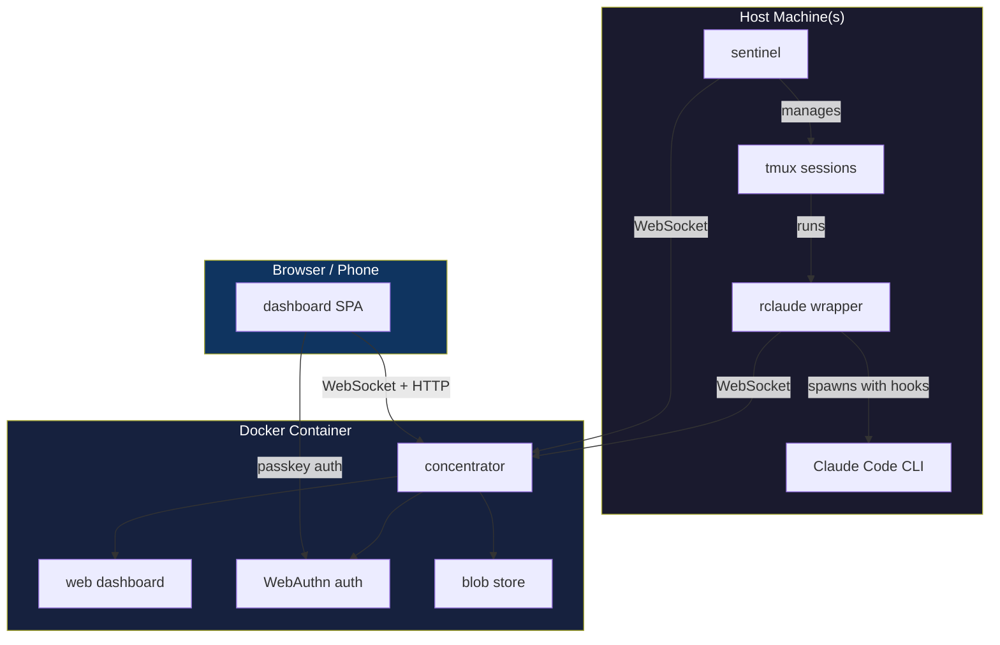

```
   _____ ______ _______ _    _ _____
  / ____|  ____|__   __| |  | |  __ \
 | (___ | |__     | |  | |  | | |__) |
  \___ \|  __|    | |  | |  | |  ___/
  ____) | |____   | |  | |__| | |
 |_____/|______|  |_|   \____/|_|

  ┌──────────────────────────────────────────────┐
  │  COMPLETE INSTALLATION + OPERATIONS MANUAL   │
  └──────────────────────────────────────────────┘
```

Full setup guide for running claudewerk: the concentrator server,
the rclaude wrapper, the dashboard, session revival sentinel, and all
supporting infrastructure.

---

## Table of Contents

1. [Prerequisites](#prerequisites)
2. [Quick Start (Local Dev)](#quick-start-local-dev)
3. [Concentrator Server (Docker)](#concentrator-server-docker)
4. [Host Setup (rclaude wrapper)](#host-setup-rclaude-wrapper)
5. [Authentication (WebAuthn Passkeys)](#authentication-webauthn-passkeys)
6. [Session Revival Sentinel (tmux)](#session-revival-agent-tmux)
7. [MCP Channel Mode](#mcp-channel-mode)
8. [Push Notifications](#push-notifications)
9. [Voice Input](#voice-input)
10. [Reverse Proxy (Caddy)](#reverse-proxy-caddy)
11. [Environment Variables Reference](#environment-variables-reference)
12. [Build Reference](#build-reference)
13. [Operations](#operations)
14. [Troubleshooting](#troubleshooting)

---

## Prerequisites

### Required (all machines)

| Tool | Version | Install | Purpose |
|------|---------|---------|---------|
| **Bun** | >= 1.0 | `curl -fsSL https://bun.sh/install \| bash` | Runtime, package manager, compiler |
| **Claude Code** | latest | `npm install -g @anthropic-ai/claude-code` | The CLI being wrapped |
| **Docker** + Compose | latest | [docker.com](https://docs.docker.com/get-docker/) | Concentrator container |
| **curl** | any | pre-installed on macOS/Linux | Hook transport |
| **openssl** | any | pre-installed on macOS/Linux | Secret generation |

### Required (session revival only)

| Tool | Version | Install | Purpose |
|------|---------|---------|---------|
| **tmux** | >= 3.0 | `brew install tmux` | Session management |

### Optional

| Tool | Purpose | Install |
|------|---------|---------|
| **Caddy** | TLS reverse proxy | [caddyserver.com](https://caddyserver.com) |

---

## Quick Start (Local Dev)

For local development with everything on one machine:

```bash
# 1. Clone and install
git clone <repo-url> claudewerk
cd claudewerk
bun install
cd web && bun install && cd ..

# 2. Build everything + create symlinks
bun run install-cli

# 3. Set up environment
export RCLAUDE_SECRET=$(openssl rand -hex 32)
export RCLAUDE_CONCENTRATOR=ws://localhost:9999

# 4. Start concentrator (local, no Docker)
bun run dev:broker

# 5. In another terminal, start the dashboard dev server
bun run dev:web

# 6. In another terminal, use rclaude
rclaude
```

Dashboard at `http://localhost:3456`, concentrator at `http://localhost:9999`.

---

## Concentrator Server (Docker)

The concentrator is the central aggregator - it receives events from all
rclaude instances and serves the web dashboard.

### 1. Configure environment

```bash
cd claudewerk

# Copy example and generate secret
cp .env.example .env

# Generate a shared secret (KEEP THIS SAFE)
echo "RCLAUDE_SECRET=$(openssl rand -hex 32)" >> .env
```

Edit `.env` for your setup:

```bash
# .env
RCLAUDE_SECRET=<your-generated-secret>
RP_ID=concentrator.example.com      # bare domain, no protocol
ORIGIN=https://concentrator.example.com
PORT=9999
```

> **WARNING:** `RP_ID` cannot be changed after passkeys are registered.
> Passkeys are cryptographically bound to the relying party ID.

### 2. Build and start

```bash
# Build frontend first (bind-mounted into container)
bun run build:web

# Build and start container
docker compose up -d

# Verify it's running
docker compose logs -f concentrator
curl -sf http://localhost:9999/health  # should return "ok"
```

### 3. Data persistence

The `concentrator-data` Docker volume contains:

| File | Contents | Criticality |
|------|----------|-------------|
| `auth.json` | Registered passkeys + users | **CRITICAL - back this up** |
| `auth.secret` | HMAC signing key for cookies | **CRITICAL** |
| `sessions.json` | Persisted session list | Recoverable |
| `session-order.json` | Sidebar tree organization | Recoverable |
| `global-settings.json` | Server-side shared settings | Recoverable |
| `project-settings.json` | Per-project labels/icons | Recoverable |
| `blobs/` | Shared files (48h TTL) | Ephemeral |

Back up `auth.json` and `auth.secret`. Loss = all passkeys gone, everyone
must re-register.

### 4. Docker Compose variants

**Standard** (`docker-compose.yml`) - uses `caddy-docker-proxy` external network:
```bash
docker compose up -d
```

**Standalone** (`docker-compose.standalone.yml`) - no external dependencies:
```bash
docker compose -f docker-compose.standalone.yml up -d
```

---

## Host Setup (rclaude wrapper)

Every machine running Claude Code needs the rclaude wrapper installed.

### 1. Build and install

```bash
cd claudewerk

# Install deps
bun install

# Build all binaries + create ~/.local/bin symlinks
bun run install-cli
```

This creates symlinks in `~/.local/bin/`:

| Symlink | Binary | Purpose |
|---------|--------|---------|
| `rclaude` | `bin/rclaude` | Main wrapper (replaces `claude`) |
| `concentrator` | `bin/broker` | Server binary |
| `concentrator-cli` | `bin/broker-cli` | Auth management CLI |
| `sentinel` | `bin/sentinel` | Session revival sentinel |
| `revive-session.sh` | `scripts/revive-session.sh` | tmux spawn script |

> **These are symlinks, not copies.** Rebuilding (`bun run build`) updates
> binaries in place - no re-linking needed. Never replace symlinks with copies.

### 2. Ensure PATH

Add `~/.local/bin` to your shell PATH if not already:

```bash
# ~/.zshrc or ~/.bashrc
export PATH="$HOME/.local/bin:$PATH"
```

### 3. Configure environment

Add to your shell config (`~/.zshrc`, `~/.bashrc`, or `~/.secrets`):

```bash
export RCLAUDE_SECRET="<same secret as concentrator>"
export RCLAUDE_CONCENTRATOR="wss://concentrator.example.com"
```

### 4. Use it

```bash
# Instead of 'claude', run:
rclaude

# All claude flags work:
rclaude --model opus --continue
rclaude --print "what time is it"
```

### What rclaude does on startup

1. Reads `~/.claude/settings.json` (your existing Claude settings)
2. Generates a merged settings file at `/tmp/rclaude-settings-{id}.json`
   that prepends curl-based hook commands for all 23 hook events
3. Spawns `claude --settings /tmp/rclaude-settings-{id}.json [your flags]`
4. Connects to concentrator via WebSocket
5. Watches the transcript JSONL file, streams events
6. Cleans up temp files on exit

rclaude **never modifies** `~/.claude/settings.json`. Your settings are safe.

---

## Authentication (WebAuthn Passkeys)

No passwords. The dashboard uses WebAuthn passkeys (Touch ID, Face ID,
security keys, platform authenticators).

### First-time setup

```bash
# 1. Create an invite code (run inside container OR use concentrator-cli)
docker exec concentrator concentrator-cli create-invite \
  --name yourname \
  --url https://concentrator.example.com

# Output: https://concentrator.example.com/auth/invite?code=abc123
```

2. Open the invite URL in your browser (one-time use, 30-minute expiry)
3. Browser prompts for passkey registration (Touch ID, etc.)
4. Done - you're authenticated

### Managing users

```bash
# List all registered users
concentrator-cli list-users [--cache-dir /path]

# Revoke access
concentrator-cli revoke --name username

# Restore access
concentrator-cli unrevoke --name username
```

### API access (scripts/CLI)

All API endpoints accept `Authorization: Bearer $RCLAUDE_SECRET`:

```bash
curl -s -H "Authorization: Bearer $RCLAUDE_SECRET" \
  https://concentrator.example.com/api/sessions
```

---

## Session Revival Sentinel (tmux)

The sentinel enables "Spawn session" and "Revive session" from the dashboard.
It runs on your host machine and manages tmux sessions.

### 1. Prerequisites

```bash
# tmux must be installed
brew install tmux  # macOS
apt install tmux   # Linux
```

### 2. Security gate

Directories must have a `.rclaude-spawn` marker file at or above the
target path. The sentinel walks up the tree looking for it.

```bash
# Allow spawning anywhere under ~/projects
touch ~/projects/.rclaude-spawn

# Or restrict to specific projects
touch ~/projects/my-app/.rclaude-spawn
```

Without the marker, spawn requests are denied.

### 3. Start the sentinel

```bash
# Using the helper script (recommended - validates deps, writes PID)
scripts/start-sentinel.sh \
  --concentrator wss://concentrator.example.com

# Or directly
sentinel \
  --concentrator wss://concentrator.example.com

# With custom spawn root (default: $HOME)
sentinel --spawn-root ~/projects
```

The sentinel:
- Connects to concentrator via WebSocket
- Listens for spawn/revive commands from the dashboard
- Creates tmux sessions/windows with full shell environment
- Sources `$SHELL -li -c "..."` so API keys, PATH, etc. are available
- All spawned sessions land in the `claudewerk` tmux session

### 4. Run sentinel on boot (optional)

**macOS launchd:**
```xml
<!-- ~/Library/LaunchAgents/com.rclaude.sentinel.plist -->
<?xml version="1.0" encoding="UTF-8"?>
<!DOCTYPE plist PUBLIC "-//Apple//DTD PLIST 1.0//EN"
  "http://www.apple.com/DTDs/PropertyList-1.0.dtd">
<plist version="1.0">
<dict>
  <key>Label</key>
  <string>com.rclaude.sentinel</string>
  <key>ProgramArguments</key>
  <array>
    <string>/Users/YOU/.local/bin/sentinel</string>
    <string>--concentrator</string>
    <string>wss://concentrator.example.com</string>
  </array>
  <key>RunAtLoad</key>
  <true/>
  <key>KeepAlive</key>
  <true/>
  <key>EnvironmentVariables</key>
  <dict>
    <key>RCLAUDE_SECRET</key>
    <string>YOUR_SECRET_HERE</string>
  </dict>
</dict>
</plist>
```

```bash
launchctl load ~/Library/LaunchAgents/com.rclaude.sentinel.plist
```

**Linux systemd:**
```ini
# ~/.config/systemd/user/sentinel.service
[Unit]
Description=rclaude Session Revival Sentinel

[Service]
ExecStart=%h/.local/bin/sentinel --concentrator wss://concentrator.example.com
Restart=always
RestartSec=10
Environment=RCLAUDE_SECRET=YOUR_SECRET_HERE

[Install]
WantedBy=default.target
```

```bash
systemctl --user enable --now sentinel
```

---

## MCP Channel Mode

Channel mode replaces PTY keystroke injection with proper MCP communication.
Claude Code connects to rclaude as an MCP channel, receiving dashboard input
as structured notifications instead of faked keystrokes.

### Enable

```bash
# Flag
rclaude --channels

# Or environment variable
export RCLAUDE_CHANNELS=1
rclaude
```

### What it does

1. Starts an MCP Streamable HTTP server on the local hook port (`/mcp`)
2. Spawns Claude with:
   - `--dangerously-load-development-channels server:rclaude`
   - `--mcp-config '{"mcpServers":{"rclaude":{"type":"http","url":"..."}}}'`
3. Auto-confirms the dev channel warning prompt
4. Dashboard input flows via MCP notifications instead of PTY

### MCP tools exposed to Claude

| Tool | Purpose |
|------|---------|
| `notify` | Send push notification to user's devices |
| `share_file` | Upload a file, get a public URL |
| `list_sessions` | Discover other channel-capable sessions |
| `send_message` | Send a message to another session |

### Slash command handling

Slash commands (`/compact`, `/clear`, `/model`, etc.) are automatically
routed via PTY even in channel mode - they need Claude Code's CLI input
layer, which channel messages bypass.

### Inter-session communication

Sessions with channels can discover and message each other:

1. Claude calls `list_sessions` to see other sessions
2. Claude calls `send_message` to reach another session
3. First contact requires dashboard user approval (ALLOW/BLOCK)
4. Approved links are bidirectional and persistent (per concentrator lifetime)

---

## Push Notifications

Web Push notifications to phone/browser when Claude needs attention.

### Setup

```bash
# Generate VAPID keys
npx web-push generate-vapid-keys

# Add to .env
VAPID_PUBLIC_KEY=BPxxx...
VAPID_PRIVATE_KEY=xxx...
```

Rebuild container: `docker compose build && docker compose up -d`

Users subscribe via the dashboard settings page. Notifications fire on
permission requests, task completions, and explicit `notify` tool calls.

---

## Voice Input

Walkie-talkie style voice input on mobile devices.

### Requirements

| Service | Env Var | Purpose |
|---------|---------|---------|
| **Deepgram** | `DEEPGRAM_API_KEY` | Real-time speech-to-text |
| **OpenRouter** | `OPENROUTER_API_KEY` | Optional Haiku refinement pass |

Add to `.env` and rebuild container. Enable "Voice FAB" in dashboard settings.

---

## Reverse Proxy (Caddy)

### With caddy-docker-proxy

Set `CADDY_HOST=concentrator.example.com` in `.env`. The `docker-compose.yml`
includes labels that caddy-docker-proxy picks up automatically for TLS.

### Manual Caddy

```
concentrator.example.com {
    reverse_proxy localhost:9999
}
```

### Other reverse proxies (nginx, etc.)

Requirements:
- WebSocket upgrade support (path: `/*`)
- TLS termination
- Proxy headers: `X-Forwarded-For`, `X-Forwarded-Proto`
- Long timeouts (WebSocket connections are long-lived)

```nginx
# nginx example
server {
    server_name concentrator.example.com;
    location / {
        proxy_pass http://localhost:9999;
        proxy_http_version 1.1;
        proxy_set_header Upgrade $http_upgrade;
        proxy_set_header Connection "upgrade";
        proxy_set_header Host $host;
        proxy_read_timeout 86400s;
    }
}
```

---

## Environment Variables Reference

### Concentrator (server-side)

| Variable | Required | Default | Description |
|----------|----------|---------|-------------|
| `RCLAUDE_SECRET` | **YES** | - | Shared secret for WS auth |
| `RP_ID` | YES (prod) | `localhost` | WebAuthn relying party domain (bare, no protocol) |
| `ORIGIN` | YES (prod) | `http://localhost:9999` | WebAuthn origin URL (with protocol) |
| `PORT` | no | `9999` | Docker port mapping |
| `CADDY_HOST` | no | - | Domain for caddy-docker-proxy labels |
| `VAPID_PUBLIC_KEY` | no | - | Web Push: public key |
| `VAPID_PRIVATE_KEY` | no | - | Web Push: private key |
| `DEEPGRAM_API_KEY` | no | - | Voice streaming: speech-to-text |
| `OPENROUTER_API_KEY` | no | - | Voice: Haiku transcript refinement |

### Host (rclaude wrapper)

| Variable | Required | Default | Description |
|----------|----------|---------|-------------|
| `RCLAUDE_SECRET` | **YES** | - | Must match concentrator |
| `RCLAUDE_CONCENTRATOR` | no | `wss://concentrator.frst.dev` | Concentrator WS URL |
| `RCLAUDE_CHANNELS` | no | - | Set `1` to enable MCP channel mode |
| `RCLAUDE_DEBUG` | no | - | Set `1` for debug logging to file |
| `RCLAUDE_DEBUG_LOG` | no | `/tmp/rclaude-debug.log` | Debug log path |
| `RCLAUDE_SPAWN_ROOT` | no | `$HOME` | Root for relative spawn paths |
| `RCLAUDE_CONVERSATION_ID` | no | auto UUID | Pre-assigned conversation ID (internal) |

---

## Build Reference

### Build everything

```bash
bun run build           # All binaries + frontend
```

### Individual targets

| Command | Output | Description |
|---------|--------|-------------|
| `bun run build:web` | `web/dist/` | Vite frontend build |
| `bun run build:wrapper` | `bin/rclaude` | rclaude CLI wrapper |
| `bun run build:broker` | `bin/broker` | Server binary |
| `bun run build:cli` | `bin/broker-cli` | Auth CLI |
| `bun run build:sentinel` | `bin/sentinel` | Host sentinel |
| `bun run gen-version` | `src/shared/version.ts` | Git hash + timestamp |

### Dev servers

| Command | Port | Description |
|---------|------|-------------|
| `bun run dev:wrapper` | - | rclaude without compile step |
| `bun run dev:broker` | 9999 | Concentrator with hot reload |
| `bun run dev:web` | 3456 | Vite dev server |

### Lint + format

```bash
bunx biome check --write .    # Auto-fix all issues
bun run typecheck              # TypeScript validation (root + web)
```

### Frontend-only deploy shortcut

Since `web/dist/` is bind-mounted into Docker, frontend changes don't
need a container rebuild:

```bash
bun run build:web
# Done - changes are live immediately
```

---

## Operations

### Updating rclaude (host machines)

```bash
cd claudewerk
git pull
bun install
bun run build
# Symlinks in ~/.local/bin already point here - done
```

### Updating concentrator (Docker)

```bash
cd claudewerk
git pull
bun install

# Frontend-only changes:
bun run build:web

# Server changes:
docker compose build && docker compose up -d
```

### Viewing logs

```bash
# Concentrator logs
docker compose logs -f concentrator

# rclaude debug log (when RCLAUDE_DEBUG=1)
tail -f /tmp/rclaude-debug.log

# Agent logs (when started with -v)
# Logs to stdout of the agent process
```

### Session diagnostics

```bash
# Fetch diagnostic data for a session
curl -s -H "Authorization: Bearer $RCLAUDE_SECRET" \
  https://concentrator.example.com/sessions/{sessionId}/diag | jq .
```

### Backup auth data

```bash
# Copy auth files from Docker volume
docker cp concentrator:/data/cache/auth.json ./backup-auth.json
docker cp concentrator:/data/cache/auth.secret ./backup-auth.secret
```

### Restore auth data

```bash
docker cp ./backup-auth.json concentrator:/data/cache/auth.json
docker cp ./backup-auth.secret concentrator:/data/cache/auth.secret
docker compose restart concentrator
```

---

## Troubleshooting

### rclaude can't connect to concentrator

```bash
# Check concentrator is running
curl -sf http://localhost:9999/health

# Check WS URL
echo $RCLAUDE_CONCENTRATOR  # should be ws:// or wss://

# Check secret matches
echo $RCLAUDE_SECRET  # must match what concentrator was started with

# Enable debug logging
RCLAUDE_DEBUG=1 rclaude
tail -f /tmp/rclaude-debug.log
```

### Dashboard shows no sessions

- Verify rclaude is running with the correct `RCLAUDE_SECRET`
- Check browser console for WebSocket errors
- Verify you're authenticated (passkey cookie present)

### Passkey registration fails

- `RP_ID` must be the bare domain (no `https://`)
- `ORIGIN` must include protocol (`https://domain.com`)
- Must be served over HTTPS in production (WebAuthn requirement)
- `localhost` works without HTTPS for local dev

### Agent can't spawn sessions

```bash
# Check tmux is installed
which tmux

# Check .rclaude-spawn marker exists
ls -la ~/projects/.rclaude-spawn

# Check agent is connected
curl -s -H "Authorization: Bearer $RCLAUDE_SECRET" \
  https://concentrator.example.com/api/sessions | jq '.agent'
```

### Channel mode not working

```bash
# Check Claude Code version (needs channel support)
claude --version

# Enable debug logging
RCLAUDE_DEBUG=1 RCLAUDE_CHANNELS=1 rclaude

# Look for MCP handshake in debug log
grep -i "mcp\|channel" /tmp/rclaude-debug.log
```

### Hook events not arriving

```bash
# Test hook delivery manually
curl -sf -X POST http://127.0.0.1:19064/hook/Test \
  -H "Content-Type: application/json" \
  -d '{"test": true}'

# Check local server is running (port varies per session)
# Look in rclaude debug log for the assigned port
grep "Local server" /tmp/rclaude-debug.log
```

### Frontend changes not showing

```bash
# Rebuild frontend
bun run build:web

# If using Docker, verify bind mount
docker exec concentrator ls /srv/web/index.html

# Hard refresh browser (Cmd+Shift+R)
```

---

## Architecture Diagram



---

*Maintained by WOPR -- the only winning move is to read the docs.*
