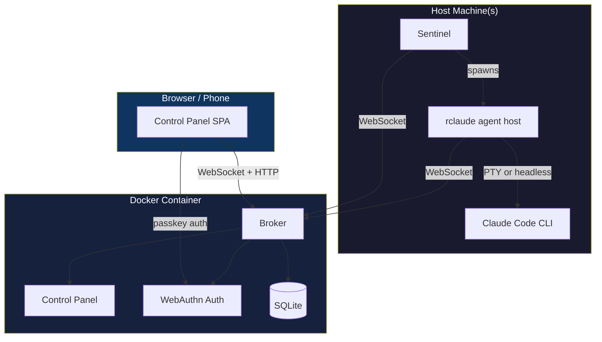

```
   _____ ______ _______ _    _ _____
  / ____|  ____|__   __| |  | |  __ \
 | (___ | |__     | |  | |  | | |__) |
  \___ \|  __|    | |  | |  | |  ___/
  ____) | |____   | |  | |__| | |
 |_____/|______|  |_|   \____/|_|

  ┌──────────────────────────────────────────────┐
  │  COMPLETE INSTALLATION + OPERATIONS MANUAL   │
  └──────────────────────────────────────────────┘
```

Full setup guide for running claudewerk: the broker server, the rclaude
agent host, the control panel, the sentinel, and all supporting
infrastructure.

---

## Table of Contents

1. [Prerequisites](#prerequisites)
2. [Quick Start (Local Dev)](#quick-start-local-dev)
3. [Broker Server (Docker)](#broker-server-docker)
4. [Host Setup (rclaude Agent Host)](#host-setup-rclaude-agent-host)
5. [Authentication (WebAuthn Passkeys)](#authentication-webauthn-passkeys)
6. [Sentinel](#sentinel)
7. [MCP Channel Mode](#mcp-channel-mode)
8. [Push Notifications](#push-notifications)
9. [Voice Input](#voice-input)
10. [Reverse Proxy (Caddy)](#reverse-proxy-caddy)
11. [Environment Variables Reference](#environment-variables-reference)
12. [Build Reference](#build-reference)
13. [Operations](#operations)
14. [Troubleshooting](#troubleshooting)

---

## Prerequisites

### Required (all machines)

| Tool | Version | Install | Purpose |
|------|---------|---------|---------|
| **Bun** | >= 1.2 | `curl -fsSL https://bun.sh/install \| bash` | Runtime, package manager |
| **Claude Code** | latest | `npm install -g @anthropic-ai/claude-code` | The CLI being wrapped |
| **Docker** + Compose | latest | [docker.com](https://docs.docker.com/get-docker/) | Broker container |
| **curl** | any | pre-installed on macOS/Linux | Hook transport |
| **openssl** | any | pre-installed on macOS/Linux | Secret generation |

### Optional

| Tool | Purpose | Install |
|------|---------|---------|
| **tmux** | PTY-mode session management | `brew install tmux` |
| **Caddy** | TLS reverse proxy | [caddyserver.com](https://caddyserver.com) |

---

## Quick Start (Local Dev)

For local development with everything on one machine:

```bash
# 1. Clone and install
git clone <repo-url> claudewerk
cd claudewerk
bun install
cd web && bun install && cd ..

# 2. Build everything
bun run build

# 3. Install agent host + sentinel globally (dogfood mode)
bun install -g ./packages/claude-agent-host ./packages/sentinel

# 4. Set up environment
export RCLAUDE_SECRET=$(openssl rand -hex 32)
export CLAUDWERK_BROKER=ws://localhost:9999

# 5. Start broker (local, no Docker)
bun run dev:broker

# 6. In another terminal, start the control panel dev server
bun run dev:web

# 7. In another terminal, use rclaude
rclaude
```

Control panel at `http://localhost:3456`, broker at `http://localhost:9999`.

---

## Broker Server (Docker)

The broker is the central aggregator -- it receives events from all rclaude
instances, persists them to SQLite, and serves the control panel.

### 1. Configure environment

```bash
cd claudewerk

# Copy example and generate secret
cp .env.example .env

# Generate a shared secret (KEEP THIS SAFE)
echo "RCLAUDE_SECRET=$(openssl rand -hex 32)" >> .env
```

Edit `.env` for your setup:

```bash
# .env
RCLAUDE_SECRET=<your-generated-secret>
RP_ID=broker.example.com          # bare domain, no protocol
ORIGIN=https://broker.example.com
PORT=9999
```

> **WARNING:** `RP_ID` cannot be changed after passkeys are registered.
> Passkeys are cryptographically bound to the relying party ID.

### 2. Build and start

```bash
# Build frontend first (bind-mounted into container)
bun run build:web

# Build and start container
docker compose up -d

# Verify it's running
docker compose logs -f broker
curl -sf http://localhost:9999/health  # should return "ok"
```

### 3. Data persistence

The `concentrator-data` Docker volume (name preserved for data continuity)
contains three SQLite databases plus auth state:

| File | Contents | Criticality |
|------|----------|-------------|
| `store.db` | Conversations, transcripts, events, KV settings, message queue, shares, scope links, address book, tasks, cost turns, hourly stats | **CRITICAL** |
| `analytics.db` | Tool-use analytics, task classification | Non-critical (errors swallowed) |
| `projects.db` | Project registry (id, cwd, scope URI, slug, label) | Permanent |
| `auth.json` | Registered passkeys + users | **CRITICAL -- back this up** |
| `auth.secret` | HMAC signing key for cookies | **CRITICAL** |
| `blobs/` | Shared files (48h TTL) | Ephemeral |

All SQLite databases use WAL mode. Back up the entire volume -- `store.db`
and `auth.*` are the critical files.

```bash
# Snapshot backup
BACKUP="concentrator-data-backup-$(date +%Y%m%d)"
docker volume create $BACKUP
docker run --rm \
  -v concentrator-data:/from:ro \
  -v $BACKUP:/to \
  alpine cp -a /from/. /to/
```

### 4. Docker Compose variants

**Standard** (`docker-compose.yml`) -- uses `caddy-docker-proxy` external network:
```bash
docker compose up -d
```

**Standalone** (`docker-compose.standalone.yml`) -- no external dependencies:
```bash
docker compose -f docker-compose.standalone.yml up -d
```

---

## Host Setup (rclaude Agent Host)

Every machine running Claude Code needs the rclaude agent host installed.

### Option A: Install via npm (recommended)

```bash
bun add -g @claudewerk/claude-agent-host @claudewerk/sentinel
```

This gives you `rclaude` and `sentinel` commands globally. Both run under Bun.

### Option B: Install from source (dogfood mode)

```bash
cd claudewerk
bun install
bun run build:packages

# Install globally via bun (creates symlink chain)
bun install -g ./packages/claude-agent-host ./packages/sentinel
```

Verify:

```bash
which rclaude          # -> ~/.bun/bin/rclaude
which sentinel         # -> ~/.bun/bin/sentinel
```

After code changes in `src/claude-agent-host/` or `src/sentinel/`:

```bash
bun run build:packages
# Done. ~/.bun/bin/rclaude already points at the new bundle via symlink chain
```

> **PATH ordering:** `~/.bun/bin` MUST come before `~/.local/bin`. Verify
> with `echo $PATH | tr ':' '\n' | grep -n bin`.

### Option C: Interactive installer

```bash
./install.sh
```

The installer handles Bun installation, dependency setup, building, and
shell configuration interactively.

### Configure environment

Add to your shell config (`~/.zshrc`, `~/.bashrc`, or `~/.secrets`):

```bash
export RCLAUDE_SECRET="<same secret as broker>"
export CLAUDWERK_BROKER="wss://broker.example.com"
```

> **Env var precedence:** `CLAUDWERK_BROKER` >> `RCLAUDE_BROKER` >>
> `RCLAUDE_CONCENTRATOR` (legacy). New setups should use `CLAUDWERK_*`.

### Use it

```bash
# Instead of 'claude', run:
rclaude

# All claude flags work:
rclaude --model opus --continue
rclaude --print "what time is it"
```

### What rclaude does on startup

1. Reads `~/.claude/settings.json` (your existing Claude settings)
2. Generates a merged settings file that prepends curl-based hook commands
   for all hook events
3. Spawns `claude` with the merged settings + your flags
4. Starts a local HTTP server (port 19000-19999, localhost only) for hook
   callbacks
5. Starts an MCP Streamable HTTP server on the local port (channel mode)
6. Connects to broker via WebSocket
7. Watches the transcript JSONL file, streams events
8. Cleans up on exit

rclaude **never modifies** `~/.claude/settings.json`. Your settings are safe.

---

## Authentication (WebAuthn Passkeys)

No passwords. The control panel uses WebAuthn passkeys (Touch ID, Face ID,
security keys, platform authenticators).

### First-time setup

```bash
# Create an invite code (run inside container OR locally)
docker exec broker broker-cli create-invite \
  --name yourname \
  --url https://broker.example.com

# Output: https://broker.example.com/auth/invite?code=abc123
```

Open the invite URL in your browser (one-time use, 30-minute expiry).
Browser prompts for passkey registration (Touch ID, etc.). Done.

### Managing users

```bash
# List all registered users
docker exec broker broker-cli list-users

# Revoke access
docker exec broker broker-cli revoke --name username

# Restore access
docker exec broker broker-cli unrevoke --name username

# Set role (e.g. user-editor for managing grants/invites from UI)
docker exec broker broker-cli set-role --name alice --role user-editor
```

### API access (scripts/CLI)

All API endpoints accept `Authorization: Bearer $RCLAUDE_SECRET`:

```bash
curl -s -H "Authorization: Bearer $RCLAUDE_SECRET" \
  https://broker.example.com/conversations
```

---

## Sentinel

The sentinel enables "Spawn conversation" and "Revive conversation" from
the control panel. It runs on your host machine and manages agent host
processes.

### Headless vs PTY spawning

The sentinel supports two modes:

| Mode | Method | Default for |
|------|--------|-------------|
| **Headless** | `Bun.spawn()` -- NDJSON over stdin/stdout | Agent-spawned conversations |
| **PTY** | tmux sessions -- full terminal emulation | User-interactive conversations |

tmux is only required for PTY mode.

### Security gate

Directories must have a `.rclaude-spawn` marker file at or above the
target path. The sentinel walks up the tree looking for it.

```bash
# Allow spawning anywhere under ~/projects
touch ~/projects/.rclaude-spawn

# Or restrict to specific projects
touch ~/projects/my-app/.rclaude-spawn
```

Without the marker, spawn requests are denied.

### Start the sentinel

```bash
# Using the helper script (recommended)
scripts/start-sentinel.sh

# With flags
scripts/start-sentinel.sh --kill-if-running --verbose

# Or directly
sentinel
```

The sentinel reads `CLAUDWERK_BROKER` (or `RCLAUDE_CONCENTRATOR`) from
your environment for the broker URL.

### Run sentinel on boot (optional)

**macOS launchd:**
```xml
<!-- ~/Library/LaunchAgents/com.claudewerk.sentinel.plist -->
<?xml version="1.0" encoding="UTF-8"?>
<!DOCTYPE plist PUBLIC "-//Apple//DTD PLIST 1.0//EN"
  "http://www.apple.com/DTDs/PropertyList-1.0.dtd">
<plist version="1.0">
<dict>
  <key>Label</key>
  <string>com.claudewerk.sentinel</string>
  <key>ProgramArguments</key>
  <array>
    <string>/Users/YOU/.bun/bin/sentinel</string>
  </array>
  <key>RunAtLoad</key>
  <true/>
  <key>KeepAlive</key>
  <true/>
  <key>StandardOutPath</key>
  <string>/tmp/sentinel.log</string>
  <key>StandardErrorPath</key>
  <string>/tmp/sentinel.err</string>
  <key>EnvironmentVariables</key>
  <dict>
    <key>PATH</key>
    <string>/Users/YOU/.bun/bin:/usr/local/bin:/usr/bin:/bin</string>
    <key>CLAUDWERK_BROKER</key>
    <string>wss://broker.example.com</string>
    <key>RCLAUDE_SECRET</key>
    <string>YOUR_SECRET_HERE</string>
  </dict>
</dict>
</plist>
```

```bash
launchctl load ~/Library/LaunchAgents/com.claudewerk.sentinel.plist
```

> **Note:** launchd does not inherit your shell environment. All required
> env vars must be in the plist's `EnvironmentVariables` dict.

**Linux systemd:**
```ini
# ~/.config/systemd/user/sentinel.service
[Unit]
Description=Claudewerk Sentinel

[Service]
ExecStart=%h/.bun/bin/sentinel
Restart=always
RestartSec=10
Environment=RCLAUDE_SECRET=YOUR_SECRET_HERE
Environment=CLAUDWERK_BROKER=wss://broker.example.com

[Install]
WantedBy=default.target
```

```bash
systemctl --user enable --now sentinel
```

---

## MCP Channel Mode

Channel mode is **on by default**. Claude Code connects to rclaude as an
MCP channel, receiving control panel input as structured notifications
instead of faked keystrokes.

### Disable (if needed)

```bash
# Flag
rclaude --no-channels

# Or environment variable
export RCLAUDE_CHANNELS=0
rclaude
```

### What it does

1. Starts an MCP Streamable HTTP server on the local hook port (`/mcp`)
2. Spawns Claude with the MCP channel configuration
3. Control panel input flows via MCP notifications instead of PTY

### MCP tools exposed to Claude

| Tool | Purpose |
|------|---------|
| `notify` | Send push notification to user's devices |
| `share_file` | Upload a file, get a public URL |
| `list_conversations` | Discover other channel-capable conversations |
| `send_message` | Send a message to another conversation |
| `configure_session` | Update project label/icon/color/keyterms |
| `spawn_session` | Launch a new conversation in a project |
| `control_session` | Stop another conversation |
| `toggle_plan_mode` | Switch plan mode on/off |
| `check_update` | Check if a newer rclaude version is available |

### Inter-conversation communication

Conversations with channels can discover and message each other:

1. Claude calls `list_conversations` to see other conversations
2. Claude calls `send_message` to reach another conversation
3. First contact requires control panel user approval (ALLOW/BLOCK)
4. Approved links are bidirectional and persistent (per broker lifetime)
5. Messages to offline conversations are queued (24h TTL, 100 max)

---

## Push Notifications

Web Push notifications to phone/browser when Claude needs attention.

### Setup

```bash
# Generate VAPID keys
npx web-push generate-vapid-keys

# Add to .env
VAPID_PUBLIC_KEY=BPxxx...
VAPID_PRIVATE_KEY=xxx...
```

Rebuild container: `docker compose up -d --build`

Users subscribe via the control panel settings page. Notifications fire on
permission requests, task completions, and explicit `notify` tool calls.

---

## Voice Input

Walkie-talkie style voice input on mobile devices.

### Requirements

| Service | Env Var | Purpose |
|---------|---------|---------|
| **Deepgram** | `DEEPGRAM_API_KEY` | Real-time speech-to-text |
| **OpenRouter** | `OPENROUTER_API_KEY` | Optional Haiku refinement pass |

Add to `.env` and rebuild container. Enable "Voice FAB" in control panel
settings.

---

## Reverse Proxy (Caddy)

### With caddy-docker-proxy

Set `CADDY_HOST=broker.example.com` in `.env`. The `docker-compose.yml`
includes labels that caddy-docker-proxy picks up automatically for TLS.

### Manual Caddy

```
broker.example.com {
    reverse_proxy localhost:9999
}
```

### Other reverse proxies (nginx, etc.)

Requirements:
- WebSocket upgrade support (path: `/*`)
- TLS termination
- Proxy headers: `X-Forwarded-For`, `X-Forwarded-Proto`
- Long timeouts (WebSocket connections are long-lived)

```nginx
# nginx example
server {
    server_name broker.example.com;
    location / {
        proxy_pass http://localhost:9999;
        proxy_http_version 1.1;
        proxy_set_header Upgrade $http_upgrade;
        proxy_set_header Connection "upgrade";
        proxy_set_header Host $host;
        proxy_read_timeout 86400s;
    }
}
```

---

## Environment Variables Reference

### Broker (server-side)

| Variable | Required | Default | Description |
|----------|----------|---------|-------------|
| `RCLAUDE_SECRET` | **YES** | - | Shared secret for WS auth |
| `RP_ID` | YES (prod) | `localhost` | WebAuthn relying party domain (bare, no protocol) |
| `ORIGIN` | YES (prod) | `http://localhost:9999` | WebAuthn origin URL (with protocol) |
| `PORT` | no | `9999` | Docker port mapping |
| `CADDY_HOST` | no | - | Domain for caddy-docker-proxy labels |
| `VAPID_PUBLIC_KEY` | no | - | Web Push: public key |
| `VAPID_PRIVATE_KEY` | no | - | Web Push: private key |
| `DEEPGRAM_API_KEY` | no | - | Voice streaming: speech-to-text |
| `OPENROUTER_API_KEY` | no | - | Voice: Haiku transcript refinement |

### Host (rclaude agent host)

Env var precedence: `CLAUDWERK_*` >> `RCLAUDE_*` >> legacy fallbacks.

| Variable | Required | Default | Description |
|----------|----------|---------|-------------|
| `RCLAUDE_SECRET` | **YES** | - | Must match broker |
| `CLAUDWERK_BROKER` | no | `wss://concentrator.frst.dev` | Broker WS URL |
| `RCLAUDE_BROKER` | no | - | Fallback for `CLAUDWERK_BROKER` |
| `RCLAUDE_CONCENTRATOR` | no | - | Legacy fallback for broker URL |
| `RCLAUDE_CHANNELS` | no | `1` | Set `0` to disable MCP channel mode |
| `RCLAUDE_DEBUG` | no | - | Set `1` for debug logging to file |
| `RCLAUDE_DEBUG_LOG` | no | `/tmp/rclaude-debug.log` | Debug log path |

### Sentinel

| Variable | Required | Default | Description |
|----------|----------|---------|-------------|
| `RCLAUDE_SECRET` | **YES** | - | Must match broker |
| `CLAUDWERK_BROKER` | no | `wss://concentrator.frst.dev` | Broker WS URL |
| `CLAUDWERK_SENTINEL_SECRET` | no | - | Per-sentinel secret (multi-sentinel) |

---

## Build Reference

### Build everything

```bash
bun run build           # All: web + broker + agent host + sentinel
```

### Individual targets

| Command | Output | Description |
|---------|--------|-------------|
| `bun run build:web` | `web/dist/` | Vite frontend build |
| `bun run build:broker` | `bin/broker` | Server binary |
| `bun run build:cli` | `bin/broker-cli` | Auth CLI |
| `bun run build:packages` | `packages/*/bin/*` | Bundled JS for npm distribution |
| `bun run build:linux` | `bin/*-linux-*` | Cross-compile for linux-x64 + linux-arm64 |
| `bun run gen-version` | `src/shared/version.ts` | Git hash + timestamp |

### Dev servers

| Command | Port | Description |
|---------|------|-------------|
| `bun run dev:claude-agent-host` | - | rclaude without compile step |
| `bun run dev:broker` | 9999 | Broker with hot reload |
| `bun run dev:web` | 3456 | Vite dev server |

### Lint + format

```bash
bun run lint              # fallow + biome + boundary check
bun run lint:biome        # Biome only (format + lint with auto-fix)
bun run lint:boundary     # Boundary rule enforcement
bun run typecheck         # TypeScript validation (root + web)
```

### Frontend-only deploy shortcut

Since `web/dist/` is bind-mounted into Docker, frontend changes don't
need a container rebuild:

```bash
bun run build:web
# Done -- changes are live immediately (hard refresh browser)
```

### Testing

```bash
bun run test              # All tests (vitest + bun test)
bun run test:integration  # Integration tests only
bun run test:sqlite       # SQLite store tests only
bun run test:staging      # Full staging: Docker build + live broker + wire protocol tests
bun run test:staging:keep # Same but keeps broker running on :19999 for debugging
```

---

## Operations

### Updating rclaude (host machines)

**npm install:**
```bash
bun add -g @claudewerk/claude-agent-host @claudewerk/sentinel
```

**From source (dogfood mode):**
```bash
cd claudewerk
git pull
bun install
bun run build:packages
# Done -- ~/.bun/bin/rclaude already points at the new bundle
```

### Updating the broker (Docker)

```bash
cd claudewerk
git pull
bun install

# Frontend-only changes:
bun run build:web

# Server changes:
docker compose up -d --build
```

### Viewing logs

```bash
# Broker logs
docker compose logs -f broker

# rclaude debug log (when RCLAUDE_DEBUG=1)
tail -f /tmp/rclaude-debug.log

# Sentinel logs
tail -f /tmp/sentinel.log
```

### Conversation diagnostics

```bash
# Fetch diagnostic data for a conversation
curl -s -H "Authorization: Bearer $RCLAUDE_SECRET" \
  https://broker.example.com/conversations/{conversationId}/diag | jq .
```

### SQL inspection (live broker)

```bash
# Query the store database (readonly, safe against live broker)
docker exec broker broker-cli query --cache-dir /data/cache \
  "SELECT COUNT(*) FROM conversations"

# Analytics database
docker exec broker broker-cli query --cache-dir /data/cache \
  --db analytics "SELECT model, COUNT(*) FROM turns GROUP BY 1"

# JSON output
docker exec broker broker-cli query --cache-dir /data/cache \
  --json "SELECT id, scope, status FROM conversations WHERE status = 'active'"
```

### Backup

```bash
# Snapshot the data volume
BACKUP="concentrator-data-backup-$(date +%Y%m%d)"
docker volume create $BACKUP
docker run --rm \
  -v concentrator-data:/from:ro \
  -v $BACKUP:/to \
  alpine cp -a /from/. /to/
```

### Restore

```bash
# Stop broker first
docker compose down

# Restore from backup volume
docker run --rm \
  -v $BACKUP:/from:ro \
  -v concentrator-data:/to \
  alpine cp -a /from/. /to/

docker compose up -d
```

---

## Troubleshooting

### rclaude can't connect to broker

```bash
# Check broker is running
curl -sf http://localhost:9999/health

# Check broker URL
echo $CLAUDWERK_BROKER  # should be ws:// or wss://

# Check secret matches
echo $RCLAUDE_SECRET  # must match what broker was started with

# Enable debug logging
RCLAUDE_DEBUG=1 rclaude
tail -f /tmp/rclaude-debug.log
```

### Control panel shows no conversations

- Verify rclaude is running with the correct `RCLAUDE_SECRET`
- Check browser console for WebSocket errors
- Verify you're authenticated (passkey cookie present)

### Passkey registration fails

- `RP_ID` must be the bare domain (no `https://`)
- `ORIGIN` must include protocol (`https://domain.com`)
- Must be served over HTTPS in production (WebAuthn requirement)
- `localhost` works without HTTPS for local dev

### Sentinel can't spawn conversations

```bash
# Check .rclaude-spawn marker exists
ls -la ~/projects/.rclaude-spawn

# Check sentinel is connected to broker
curl -s -H "Authorization: Bearer $RCLAUDE_SECRET" \
  https://broker.example.com/sentinel/status | jq .
```

### Channel mode not working

```bash
# Check Claude Code version (needs channel support)
claude --version

# Enable debug logging
RCLAUDE_DEBUG=1 rclaude
grep -i "mcp\|channel" /tmp/rclaude-debug.log
```

### Hook events not arriving

```bash
# Test hook delivery manually (port varies per conversation)
# Check debug log for the assigned port
grep "Local server" /tmp/rclaude-debug.log

curl -sf -X POST http://127.0.0.1:<port>/hook/Test \
  -H "Content-Type: application/json" \
  -d '{"test": true}'
```

### Frontend changes not showing

```bash
# Rebuild frontend
bun run build:web

# If using Docker, verify bind mount
docker exec broker ls /srv/web/index.html

# Hard refresh browser (Cmd+Shift+R)
```

### Protocol version mismatch

Old agent host binaries connecting to a new broker get a
`protocol_upgrade_required` rejection. The control panel shows a persistent
toast with an upgrade command. Fix:

```bash
bun add -g @claudewerk/claude-agent-host @claudewerk/sentinel
# Or from source: bun run build:packages
```

---

## Architecture Diagram



---

*Maintained by WOPR -- the only winning move is to read the docs.*
